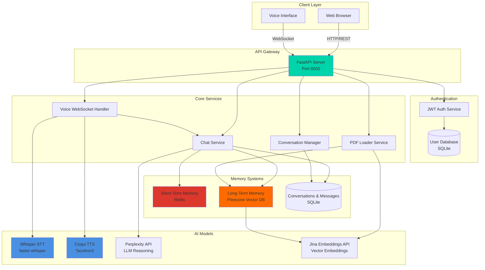
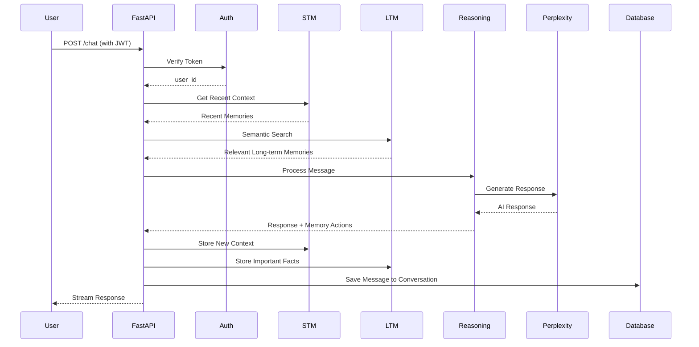
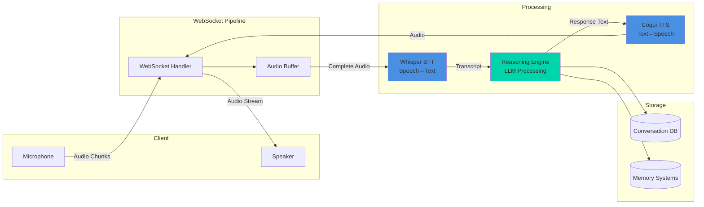
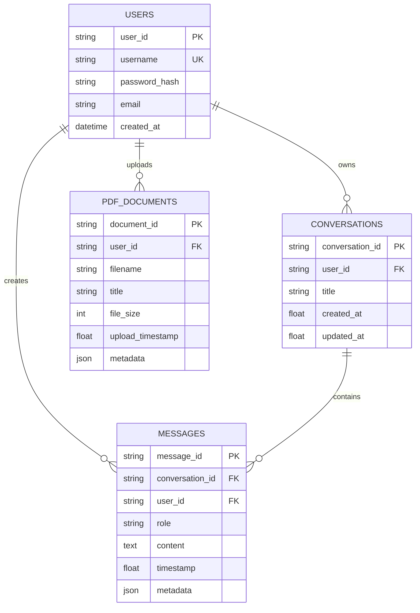

# CognitiveAI – Memory-Augmented Personal Intelligence Engine

> **A production-grade AI therapist platform with dual-memory architecture, real-time voice conversations, multi-user authentication, and PDF knowledge ingestion.**

[](https://fastapi.tiangolo.com/)
[](https://www.python.org/)
[](https://redis.io/)
[](https://www.pinecone.io/)

---

## 📋 Table of Contents

- [Overview](#overview)
- [System Architecture](#system-architecture)
- [Core Features](#core-features)
- [Technology Stack](#technology-stack)
- [Installation & Setup](#installation--setup)
- [API Documentation](#api-documentation)
- [Deployment](#deployment)
- [Development](#development)
- [Testing](#testing)

---

## 🎯 Overview

**CognitiveAI/ AI Therapist** is an enterprise-grade conversational AI platform designed for therapeutic and personal intelligence applications. It combines short-term and long-term memory systems with real-time voice capabilities, enabling natural, context-aware conversations that persist across sessions.

### Key Highlights

- 🧠 **Dual-Memory Architecture**: Redis-backed STM + Pinecone vector LTM
- 🎤 **Real-Time Voice Agent**: Whisper STT + Coqui TTS with WebSocket streaming
- 👥 **Multi-User System**: JWT authentication with per-user data isolation
- 📚 **PDF Knowledge Base**: Semantic search over uploaded documents
- 💬 **Persistent Conversations**: SQLite-backed chat history with conversation management
- 🚀 **Production-Ready**: Docker deployment, health checks, comprehensive error handling

---

## 🏗️ System Architecture

### High-Level Architecture



### Data Flow Architecture



### Voice Agent Architecture



### Database Schema



---

## ✨ Core Features

### 1. 🎤 Real-Time Voice Agent

**Status**: ✅ Backend Complete | 🚧 Frontend In Progress

- **Speech-to-Text**: faster-whisper (4x faster than vanilla Whisper)
  - Model: `openai/whisper-medium` (configurable)
  - Voice Activity Detection (VAD) to skip silence
  - Multi-language support (99 languages)
  - Latency: <2s for 5-second audio

- **Text-to-Speech**: Coqui TTS
  - Model: `tts_models/en/ljspeech/tacotron2-DDC`
  - Local synthesis (no API costs)
  - Natural voice quality
  - Streaming support

- **WebSocket Protocol**: Real-time bidirectional audio streaming
  - Endpoint: `/ws/voice?token={jwt_token}`
  - Audio buffering and chunking
  - Session management with conversation persistence

### 2. 🧠 Dual-Memory System

#### Short-Term Memory (STM)
- **Backend**: Redis with TTL-based expiration
- **Purpose**: Rolling context window for active conversations
- **Features**:
  - Automatic expiration (default: 30 minutes)
  - Relevance scoring with time decay
  - Query-based retrieval
  - Per-user isolation

#### Long-Term Memory (LTM)
- **Backend**: Pinecone serverless vector database
- **Purpose**: Persistent facts, preferences, and conversation highlights
- **Features**:
  - Semantic search using Jina embeddings (768-dim)
  - Memory types: facts, preferences, tasks, highlights
  - Importance scoring
  - User-scoped filtering

### 3. 👥 Multi-User Authentication

- **JWT-based authentication** with bcrypt password hashing
- **Endpoints**:
  - `POST /auth/signup` - User registration
  - `POST /auth/login` - Authentication
  - `POST /auth/logout` - Session cleanup
  - `GET /auth/me` - User profile

- **Security Features**:
  - Password validation (min 8 chars, complexity requirements)
  - Username validation (3-30 chars, alphanumeric + underscore)
  - Token expiration (24 hours default)
  - Per-user data isolation across all services

### 4. 💬 Conversation Management

- **Persistent chat history** stored in SQLite
- **Features**:
  - Automatic conversation creation
  - Title generation from first message
  - Message threading with timestamps
  - Conversation listing and search
  - Delete and update operations

- **Endpoints**:
  - `GET /conversations` - List user conversations
  - `GET /conversations/{id}/messages` - Get conversation history
  - `DELETE /conversations/{id}` - Delete conversation
  - `PATCH /conversations/{id}` - Update conversation title

### 5. 📚 PDF Knowledge Base

- **PDF ingestion** with automatic chunking and embedding
- **Features**:
  - Text extraction using `pdfplumber`
  - Semantic chunking (configurable size)
  - Vector storage in Pinecone LTM
  - Document-scoped and global search
  - Metadata tracking (filename, upload time, file size)

- **Endpoints**:
  - `POST /upload_pdf` - Upload and process PDF
  - `GET /pdf_documents` - List user's PDFs
  - `DELETE /pdf/{doc_id}` - Delete PDF and embeddings

### 6. 🤖 Cognitive Reasoning Engine

- **LLM Provider**: Perplexity API (Sonar models)
- **Features**:
  - Context-aware response generation
  - Memory integration (STM + LTM + PDF)
  - Streaming responses
  - Memory action extraction
  - Conversation context management

---

## 🛠️ Technology Stack

### Backend
| Component | Technology | Purpose |
|-----------|-----------|---------|
| **API Framework** | FastAPI 0.109+ | High-performance async REST API |
| **Authentication** | JWT + bcrypt | Secure user authentication |
| **Database** | SQLite (WAL mode) | User data, conversations, messages |
| **Short-Term Memory** | Redis 7.0+ | Ephemeral session context |
| **Long-Term Memory** | Pinecone Serverless | Vector database for semantic search |
| **Embeddings** | Jina AI API | 768-dim text embeddings |
| **LLM** | Perplexity API | Reasoning and response generation |
| **STT** | faster-whisper | Speech-to-text transcription |
| **TTS** | Coqui TTS | Text-to-speech synthesis |
| **PDF Processing** | pdfplumber | PDF text extraction |

### Frontend
| Component | Technology | Purpose |
|-----------|-----------|---------|
| **Framework** | Vanilla HTML/CSS/JS | Static frontend served by FastAPI |
| **Styling** | Custom CSS | Responsive, modern UI |
| **Communication** | Fetch API + WebSocket | REST API calls and voice streaming |

### Infrastructure
| Component | Technology | Purpose |
|-----------|-----------|---------|
| **Containerization** | Docker | Single-server deployment |
| **Process Manager** | Uvicorn | ASGI server |
| **Deployment** | Render / Docker Compose | Cloud and local deployment |

---

## 🚀 Installation & Setup

### Prerequisites

- **Python 3.11+**
- **Redis 7.0+** (local or cloud instance)
- **ffmpeg** (for audio processing)
- **API Keys**:
  - Perplexity API key
  - Pinecone API key
  - Jina AI API key
  - Redis URL (if using cloud Redis)

### Local Development Setup

#### 1. Clone Repository

```bash
git clone https://github.com/Shashwat-Akhilesh-Shukla/AI-Therapist.git
cd AI-Therapist
```

#### 2. Install System Dependencies

**Windows**:
```bash
# Install ffmpeg via chocolatey
choco install ffmpeg
```

**Linux**:
```bash
sudo apt-get update
sudo apt-get install ffmpeg redis-server
```

**macOS**:
```bash
brew install ffmpeg redis
```

#### 3. Create Virtual Environment

```bash
python -m venv .venv

# Windows
.venv\Scripts\activate

# Linux/macOS
source .venv/bin/activate
```

#### 4. Install Python Dependencies

```bash
cd backend
pip install -r requirements.txt
```

**Note**: First installation downloads ~1.8GB of dependencies (PyTorch, Whisper, TTS models).

#### 5. Configure Environment Variables

Create `backend/.env`:

```bash
# Authentication
JWT_SECRET_KEY=your-super-secret-key-change-in-production

# Redis (Short-Term Memory)
REDIS_URL=redis://localhost:6379/0
STM_TTL=1800

# Pinecone (Long-Term Memory)
PINECONE_API_KEY=your-pinecone-api-key
PINECONE_CLOUD=aws
PINECONE_REGION=us-east-1

# LLM Provider
PERPLEXITY_API_KEY=your-perplexity-api-key

# Embeddings
JINA_API_KEY=your-jina-api-key

# Voice Agent Configuration
VOICE_ENABLED=true
MODEL_CACHE_DIR=backend/models
VOICE_PRELOAD_MODELS=false

# STT Configuration (Whisper)
WHISPER_MODEL=openai/whisper-medium
WHISPER_DEVICE=cpu
WHISPER_COMPUTE_TYPE=int8

# TTS Configuration (Coqui)
TTS_PROVIDER=coqui
COQUI_MODEL=tts_models/en/ljspeech/tacotron2-DDC

# Audio Settings
AUDIO_SAMPLE_RATE=16000
AUDIO_CHUNK_DURATION=3
MAX_AUDIO_DURATION=60

# CORS (optional)
FRONTEND_URL=http://localhost:3000
```

#### 6. Start Redis (if running locally)

```bash
# Linux/macOS
redis-server

# Windows (if installed via WSL or native)
redis-server.exe
```

#### 7. Run the Backend

```bash
# From project root
uvicorn backend.main:app --reload --host 0.0.0.0 --port 8000
```

#### 8. Access the Application

- **Frontend**: http://localhost:8000
- **API Docs**: http://localhost:8000/docs
- **Health Check**: http://localhost:8000/health

---

## 📡 API Documentation

### Authentication Endpoints

#### `POST /auth/signup`
Create a new user account.

**Request**:
```json
{
  "username": "john_doe",
  "password": "SecurePass123!",
  "email": "john@example.com"
}
```

**Response**:
```json
{
  "success": true,
  "message": "User created successfully",
  "token": "eyJhbGciOiJIUzI1NiIsInR5cCI6IkpXVCJ9...",
  "user": {
    "user_id": "uuid-here",
    "username": "john_doe",
    "email": "john@example.com",
    "created_at": "2024-01-20T10:30:00Z"
  }
}
```

#### `POST /auth/login`
Authenticate and receive JWT token.

**Request**:
```json
{
  "username": "john_doe",
  "password": "SecurePass123!"
}
```

**Response**: Same as signup.

#### `POST /auth/logout`
Clear user session data (STM, temporary PDFs).

**Headers**: `Authorization: Bearer {token}`

**Response**:
```json
{
  "success": true,
  "message": "Logout successful. Client must discard the access token...",
  "client_discard_token": true
}
```

### Chat Endpoints

#### `POST /chat`
Send a message and receive AI response.

**Headers**: `Authorization: Bearer {token}`

**Request**:
```json
{
  "message": "What did we discuss yesterday?",
  "conversation_id": "optional-conversation-id",
  "doc_id": "optional-pdf-document-id"
}
```

**Response**:
```json
{
  "response": "Based on our previous conversation...",
  "conversation_id": "uuid-here",
  "reasoning": {
    "stm_used": true,
    "ltm_used": true,
    "pdf_context": false
  },
  "metadata": {
    "processing_time": 1.23,
    "model": "perplexity-sonar"
  }
}
```

### Conversation Endpoints

#### `GET /conversations`
List all conversations for the authenticated user.

**Headers**: `Authorization: Bearer {token}`

**Query Parameters**:
- `limit` (int, default: 20)
- `offset` (int, default: 0)

**Response**:
```json
{
  "success": true,
  "conversations": [
    {
      "conversation_id": "uuid-1",
      "title": "Discussion about anxiety",
      "created_at": 1705750800.0,
      "updated_at": 1705837200.0
    }
  ],
  "count": 1
}
```

#### `GET /conversations/{conversation_id}/messages`
Get all messages in a conversation.

**Headers**: `Authorization: Bearer {token}`

**Response**:
```json
{
  "success": true,
  "conversation": {
    "conversation_id": "uuid-1",
    "title": "Discussion about anxiety",
    "created_at": 1705750800.0,
    "updated_at": 1705837200.0
  },
  "messages": [
    {
      "message_id": "msg-1",
      "role": "user",
      "content": "I'm feeling anxious today",
      "timestamp": 1705750800.0,
      "metadata": {}
    },
    {
      "message_id": "msg-2",
      "role": "assistant",
      "content": "I understand. Let's talk about it...",
      "timestamp": 1705750801.0,
      "metadata": {"reasoning": {...}}
    }
  ],
  "count": 2
}
```

### PDF Endpoints

#### `POST /upload_pdf`
Upload and process a PDF document.

**Headers**: `Authorization: Bearer {token}`

**Request**: `multipart/form-data` with file upload

**Response**:
```json
{
  "success": true,
  "message": "PDF processed successfully",
  "document_id": "doc-uuid",
  "chunks_stored": 42,
  "metadata": {
    "filename": "research.pdf",
    "file_size": 1024000,
    "upload_timestamp": 1705750800.0
  }
}
```

#### `GET /pdf_documents`
List all uploaded PDFs for the user.

**Headers**: `Authorization: Bearer {token}`

**Response**:
```json
{
  "success": true,
  "documents": [
    {
      "document_id": "doc-uuid",
      "filename": "research.pdf",
      "title": "Research Paper",
      "file_size": 1024000,
      "upload_timestamp": 1705750800.0,
      "metadata": {}
    }
  ]
}
```

### Voice Endpoints

#### `WebSocket /ws/voice?token={jwt_token}`
Real-time voice conversation.

**Client → Server Messages**:
```json
{
  "type": "audio",
  "data": "base64-encoded-audio-chunk"
}
```

**Server → Client Messages**:
```json
// Status update
{
  "type": "status",
  "state": "listening|processing|speaking",
  "message": "Processing your speech...",
  "timestamp": 1705750800.123
}

// Transcript
{
  "type": "transcript",
  "text": "Hello, how are you?",
  "language": "en",
  "timestamp": 1705750800.123
}

// Audio response
{
  "type": "audio",
  "data": "base64-encoded-audio",
  "format": "wav",
  "timestamp": 1705750800.123
}

// Error
{
  "type": "error",
  "message": "Error description",
  "code": "ERROR_CODE",
  "timestamp": 1705750800.123
}
```

#### `GET /voice/info`
Get voice functionality status.

**Headers**: `Authorization: Bearer {token}`

**Response**:
```json
{
  "voice_enabled": true,
  "models": {
    "models_loaded": true,
    "stt_loaded": true,
    "tts_loaded": true,
    "cache_dir": "backend/models",
    "config": {
      "whisper_model": "openai/whisper-medium",
      "coqui_model": "tts_models/en/ljspeech/tacotron2-DDC"
    }
  },
  "capabilities": {
    "stt": true,
    "tts": true,
    "streaming": true,
    "languages": ["en"]
  }
}
```

### Health Check

#### `GET /health`
Comprehensive system health check.

**Response**:
```json
{
  "status": "healthy",
  "timestamp": "2024-01-20T10:30:00Z",
  "services": {
    "database": {"available": true, "status": "ok"},
    "redis": {"available": true, "status": "ok"},
    "pinecone": {"available": true, "status": "ok"},
    "perplexity": {"available": true, "status": "ok"}
  },
  "systems": {
    "database": true,
    "stm": true,
    "ltm": true,
    "pdf_loader": true,
    "reasoning_engine": true
  }
}
```

---

## 🐳 Deployment

### Docker Deployment

#### Local Testing with Docker

1. **Build the image**:
```bash
docker build -t ai-therapist .
```

2. **Run with Docker Compose**:
```bash
# Copy environment template
cp .env.docker.example .env

# Edit .env with your API keys
# Then run:
docker-compose up
```

3. **Access**:
- Frontend: http://localhost:8000
- API Docs: http://localhost:8000/docs
- Health: http://localhost:8000/health

#### Deploying to Render

1. **Push to GitHub**:
```bash
git push origin main
```

2. **Create Web Service on Render**:
- Connect GitHub repository
- Select "Docker" environment
- Render auto-detects `Dockerfile`

3. **Configure Environment Variables** in Render dashboard:
```
PERPLEXITY_API_KEY=your-key
PINECONE_API_KEY=your-key
PINECONE_CLOUD=aws
PINECONE_REGION=us-east-1
REDIS_URL=your-redis-url
JWT_SECRET_KEY=your-secure-secret
JINA_API_KEY=your-key
STM_TTL=3600
FRONTEND_URL=https://your-app.onrender.com
VOICE_ENABLED=true
```

4. **Deploy**: Render builds and deploys automatically

#### Database Persistence

⚠️ **Important**: SQLite is ephemeral in Docker by default.

**Options**:
- **Persistent Disk** (Recommended): Enable Render's persistent disk (paid plans)
- **PostgreSQL**: Migrate to Render's PostgreSQL (see migration guide)
- **Accept Resets**: Database resets on deployment (not for production)

---

## 💻 Development

### Project Structure

```
AI-Therapist/
├── backend/
│   ├── main.py                    # FastAPI application
│   ├── auth.py                    # Authentication service
│   ├── database.py                # SQLite database layer
│   ├── conversations.py           # Conversation manager
│   ├── reasoning.py               # Cognitive reasoning engine
│   ├── pdf_loader.py              # PDF processing
│   ├── redis_client.py            # Redis connection
│   ├── requirements.txt           # Python dependencies
│   ├── memory/
│   │   ├── stm.py                 # Short-term memory (Redis)
│   │   └── ltm.py                 # Long-term memory (Pinecone)
│   └── voice/
│       ├── model_manager.py       # Model loading & caching
│       ├── audio_utils.py         # Audio processing utilities
│       ├── stt.py                 # Whisper STT
│       ├── tts.py                 # Coqui TTS
│       └── websocket_handler.py   # Voice WebSocket handler
├── static/
│   ├── index.html                 # Frontend HTML
│   ├── app.js                     # Frontend JavaScript
│   └── styles.css                 # Frontend CSS
├── Dockerfile                     # Docker configuration
├── docker-compose.yml             # Docker Compose setup
├── render.yaml                    # Render deployment config
└── README.md                      # This file
```

### Running Tests

```bash
# Install test dependencies
pip install pytest pytest-asyncio

# Run all tests
pytest -v

# Run specific test suites
pytest test_voice_backend.py -v
pytest test_chat_history_preservation.py -v
pytest test_conversation_architecture.py -v
```

### Code Quality

```bash
# Format code
black backend/

# Lint
flake8 backend/

# Type checking
mypy backend/
```

---

## 🧪 Testing

### Automated Tests

| Test Suite | Coverage | Command |
|------------|----------|---------|
| Voice Backend | STT, TTS, WebSocket | `pytest test_voice_backend.py -v` |
| Chat History | Persistence, retrieval | `pytest test_chat_history_preservation.py -v` |
| Conversation Architecture | CRUD operations | `pytest test_conversation_architecture.py -v` |
| PDF Handling | Upload, search, snippets | `pytest test_pdf_snippet_handling.py -v` |

### Manual Testing

1. **Authentication Flow**:
   - Signup at http://localhost:8000
   - Login and verify JWT token
   - Test protected endpoints

2. **Chat Functionality**:
   - Send messages and verify responses
   - Check conversation persistence
   - Test memory retrieval (STM + LTM)

3. **PDF Knowledge**:
   - Upload a PDF
   - Query PDF content
   - Verify semantic search

4. **Voice Agent** (when frontend complete):
   - Connect to WebSocket
   - Send audio chunks
   - Verify transcription and TTS response

---

## 🔧 Troubleshooting

### Common Issues

#### Models Not Downloading
```bash
# Manually download models
python -c "from backend.voice.model_manager import ModelManager; ModelManager.preload_models()"
```

#### High Memory Usage
- Use smaller Whisper model: `WHISPER_MODEL=openai/whisper-small`
- Enable INT8 quantization: `WHISPER_COMPUTE_TYPE=int8`
- Limit concurrent voice sessions

#### Slow Transcription
- Use GPU: `WHISPER_DEVICE=cuda` (requires CUDA)
- Use smaller model: `WHISPER_MODEL=openai/whisper-tiny`
- Ensure VAD is enabled (default)

#### Redis Connection Issues
- Verify Redis is running: `redis-cli ping`
- Check `REDIS_URL` in `.env`
- For cloud Redis, verify network access

#### Pinecone Errors
- Verify API key and region
- Check index exists: `pinecone.list_indexes()`
- Ensure correct dimension (768 for Jina embeddings)

---

## 📚 Additional Documentation

- [Voice Backend Implementation](VOICE_BACKEND_README.md) - Detailed voice agent documentation
- [Deployment Guide](DEPLOYMENT.md) - Production deployment instructions
- [Quick Start Guide](QUICKSTART.md) - Fast setup for development

---

## 🤝 Contributing

Contributions are welcome! Please follow these guidelines:

1. Fork the repository
2. Create a feature branch (`git checkout -b feature/amazing-feature`)
3. Commit changes (`git commit -m 'Add amazing feature'`)
4. Push to branch (`git push origin feature/amazing-feature`)
5. Open a Pull Request

---

## 📄 License

This project is licensed under the MIT License - see the LICENSE file for details.

---

## 🙏 Acknowledgments

- **OpenAI Whisper** - Speech recognition
- **Coqui TTS** - Text-to-speech synthesis
- **Pinecone** - Vector database
- **Perplexity AI** - LLM reasoning
- **Jina AI** - Embeddings API
- **FastAPI** - Web framework

---

## 📞 Support

For issues, questions, or contributions:
- **GitHub Issues**: [Create an issue](https://github.com/Shashwat-Akhilesh-Shukla/AI-Therapist/issues)
- **Documentation**: See additional docs in the repository

---

**Built with ❤️ for therapeutic AI applications**
